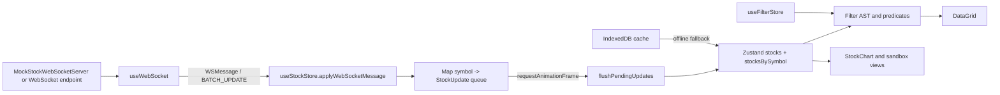

# Architecture

## Component Hierarchy

```text
App Router
|- page.tsx
|- DataGrid
|  |- stockColumns
|  |- CellRenderers / FlashCell
|  |- ContextMenu
|  `- useGridKeyboardNavigation
|- StockChart
|  |- ChartControls
|  |- StockChartClient (Lightweight Charts v4)
|  `- RSIChart / RSIChartClient
|- ConnectionStatus
`- Sandbox
   |- SectorHeatmap
   |- PriceAlerts
   `- ExportData
```

## State And Data Flow



`useStockStore` coalesce actualizaciones del mismo simbolo en un `Map<string, StockUpdate>`. Solo el siguiente frame descarga el lote al estado observable, reduciendo renders durante rafagas de WebSocket. `DataGrid` recibe la lista resultante y virtualiza las filas antes de dibujarlas.

## Main Modules

| Area | Module | Responsibility |
| --- | --- | --- |
| Domain | `src/types` | Contratos estrictos para acciones, filtros, charts y mensajes WebSocket. |
| Ingestion | `src/lib/data/stockAdapter.ts` | Normaliza entradas y rechaza numeros no finitos. |
| Realtime | `src/hooks/useWebSocket.ts` | Conexion, mensajes, reconexion y backoff seguro. |
| Store | `src/store/stockStore.ts` | Estado de mercado y batch rAF. |
| Filtering | `src/lib/filterEngine` | AST, predicados, presets y benchmark. |
| Grid | `src/components/grid` | Tabla TanStack, virtualizacion, pinning y navegacion. |
| Charts | `src/components/chart` | Velas, overlays, RSI, Volume Profile y captura PNG. |
| Offline | `src/lib/db/indexedDB.ts` | Cache del universo de acciones e historial OHLCV. |

## Technical Decisions

### App Router and client boundaries

Next.js App Router conserva rendering de servidor para la ruta y usa componentes cliente solo donde se requiere estado, DOM o navegacion. Los charts se importan con `next/dynamic` y `ssr: false`, porque Lightweight Charts necesita APIs de navegador.

### Strict domain contracts

`Stock` usa campos obligatorios y metricas numericas no nulas. Los adaptadores son la frontera de validacion: el resto de la aplicacion puede operar con numeros finitos sin defensas repetidas en cada filtro o celda.

### Virtualized grid

La tabla usa TanStack Table v8 y TanStack Virtual v3, con filas de 36 px y overscan de 15. La altura estable del viewport y de cada fila evita cambios de layout durante carga, ordenacion o scroll.

### Realtime batching

El store acumula actualizaciones WebSocket por simbolo y programa una sola descarga por `requestAnimationFrame`. Esta politica mantiene el ultimo valor de cada simbolo por frame y evita una cascada de renders por tick.

### Offline first fallback

Las cargas de acciones e historial intentan red cuando esta disponible y actualizan IndexedDB. Sin conexion o ante error de red, devuelven la ultima cache con metadatos de origen.

### Financial calculations

Los indicadores se implementan localmente y se prueban contra datasets conocidos: SMA con ventana deslizante, EMA con semilla SMA, RSI mediante suavizado de Wilder, Bollinger con desviacion poblacional y Volume Profile por solapamiento de rangos.